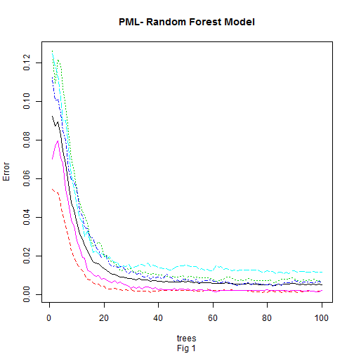

##Practical Machine Learning Course Project Write Up 


###Introduction :

This study aims at using data on activity monitors collected by the quantified self movement to predict activity quality of execise movements. Quantitfied Self Movement are a group of enthusiasts who take measurements about themselves regularly to improve their health, to find patterns in their behavior, or because they are tech geeks. This prediction algorithm is then intended to be used to provide feedback to exercisers about the quality of their movement in order to reduce the risk of injuries due to wrong movements. The data is collected from accelerometers on the belt, forearm, arm, and dumbell of 6 participants. They were asked to perform barbell lifts correctly and incorrectly in 5 different ways. More information is available from the website link, [WLE](http://groupware.les.inf.puc-rio.br/har#weight_lifting_exercises).

###Loading and Processing the Data:

The training data can be downloaded from [trainingdata](https://d396qusza40orc.cloudfront.net/predmachlearn/pml-training.csv).

The testing data can be downloaded from [testingdata](https://d396qusza40orc.cloudfront.net/predmachlearn/pml-testing.csv).

####Load Data into R:


```r
# Check if required files exist in working directory. If not download it
if(!file.exists('pml-training.csv')){
    download.file("https://d396qusza40orc.cloudfront.net/predmachlearn/pml-training.csv",destfile="pml-training.csv")
}
if(!file.exists('pml-testing.csv')){
    download.file("https://d396qusza40orc.cloudfront.net/predmachlearn/pml-testing.csv",destfile="pml-training.csv")
}

# Load files to R
train.pml=read.csv("pml-training.csv",stringsAsFactors=F)
test.pml=read.csv("pml-testing.csv",stringsAsFactors=F)
```

####Exploring the Data:

***Training set dimensions:***


```r
dim(train.pml) #dimension of training dataset
```

```
## [1] 19622   160
```

***Brief Look at its structure:***


```r
str(train.pml[1:10])
```

```
## 'data.frame':	19622 obs. of  10 variables:
##  $ X                   : int  1 2 3 4 5 6 7 8 9 10 ...
##  $ user_name           : chr  "carlitos" "carlitos" "carlitos" "carlitos" ...
##  $ raw_timestamp_part_1: int  1323084231 1323084231 1323084231 1323084232 1323084232 1323084232 1323084232 1323084232 1323084232 1323084232 ...
##  $ raw_timestamp_part_2: int  788290 808298 820366 120339 196328 304277 368296 440390 484323 484434 ...
##  $ cvtd_timestamp      : chr  "05/12/2011 11:23" "05/12/2011 11:23" "05/12/2011 11:23" "05/12/2011 11:23" ...
##  $ new_window          : chr  "no" "no" "no" "no" ...
##  $ num_window          : int  11 11 11 12 12 12 12 12 12 12 ...
##  $ roll_belt           : num  1.41 1.41 1.42 1.48 1.48 1.45 1.42 1.42 1.43 1.45 ...
##  $ pitch_belt          : num  8.07 8.07 8.07 8.05 8.07 8.06 8.09 8.13 8.16 8.17 ...
##  $ yaw_belt            : num  -94.4 -94.4 -94.4 -94.4 -94.4 -94.4 -94.4 -94.4 -94.4 -94.4 ...
```

####Processing the Data:


```r
# Extract training data column namess without NA or empty values

idx=apply(train.pml,2,function(x) sum(is.na(x)|x=="")) #Extracting NA Nos per column
names.notna=names(train.pml[idx/nrow(train.pml)<=0.7]) #Extracting col names without more than 70% NA and/or spaces

# Tidy the training dataset

train.pml=train.pml[names.notna] #Extract columns without NA & ""
train.pml=train.pml[-c(1:7)] #Remove first seven info columns

# Split the training data to training and cross-validation datasets

intrain=sample(nrow(train.pml),nrow(train.pml)*0.8)
cv.pml=train.pml[-intrain,] #Cross validation dataset
train.pml=train.pml[intrain,] #training dataset
```

###Modelling Data & Predicting :

Randomforest has been acknowledged to provide the best accuracy for modelling classifiers, so I will be  using Randomforest for modelling this data set. In order to improve processing speed, have a generalized solution and to be adequately accurate for the required test predictions, number of trees, **ntree=100**, is used.


```r
library(randomForest)

set.seed(2014) #set seed to improve reporducibility

# Set the random forest model with training and cross validation data
modrf.pml=randomForest(factor(classe)~.,data=train.pml,ntree=ntree,keep.forest=T,xtest=cv.pml[-53],ytest=factor(cv.pml$classe))
```

#####In-Sample Error Rate :

Is the error rate for the predictions for ***input data (training data)*** to the model. OOB error rate is  **0.015**, (***mean(modrf.pml$err.rate)***). The in-sample error rate is **0**

#####Out Of Sample Error Rate :

Out of sample error will be the error rate for predictions on the cross validated data provided to the model. It is normally higher than the in-sample error rate and is **0.0084**, (***mean(modrf.pml\$test\$err.rate)***).

#####Prediction for test data:

Prediction for the test data is provided by:


```r
answer=predict(modrf.pml,test.pml)
```

There is a certain element of randomness to randomforest, hence, hardware, operating system and time of use may effect the final answer. **Fig 1**, below shows that increasing the number of trees improves accuracy, so increasing the number of trees, **ntree** would improve the accuracy of predictions. From **Fig 1**, it is apparent that error rates improve slowly for trees beyond about 50. Use the following answer key to check your output.

**answer=c("B","A","B","A","A","E","D","B","A","A","B","C","B","A","E","E","A","B","B","B")**


```r
plot(modrf.pml,main="PML- Random Forest Model",sub="Fig 1")
```

 


